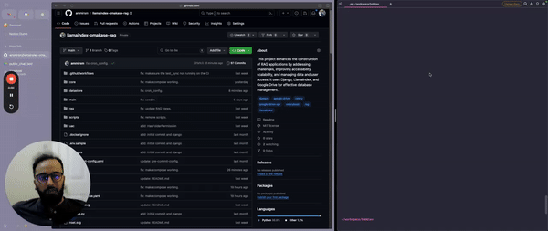

[](https://www.python.org/downloads/release/python-390/ "Python 3.10")
[](https://www.djangoproject.com/download/ "Django 4.2.9")
[](https://www.llamaindex.ai/ "LlamaIndex 0.10.6")
[](https://www.postgresql.org/download/ "PostgreSQL 15")
[](https://docs.celeryproject.org/en/stable/getting-started/introduction.html "Celery 5.3.6")

[](https://github.com/0xbow-io/asp-admin-dashboard "The Repository is well Maintained.")


## Supported By

<a href="https://llamaindex.ai/"></a>
<a href="https://labs.nset.io"></a>

# Omakase RAG Orchestrator
## django-llamaindex-google-drive-template

Welcome to  Omakase RAG Orchestrator (django-llamaindex-google-drive-template). This initiative aims to address the challenges associated with building RAG applications — transitioning from the concept stage to a live, functional app.

Traditionally, RAG applications start as Python scripts, not full-fledged web applications, limiting their accessibility and scalability. They rely on a knowledge base that doesn't update automatically, requiring the use of external tools for regular updates. Additionally, standard RAG data architectures lack sophisticated user access and permission controls, crucial for multi-user environments.

To tackle these challenges, we are building a comprehensive web application with an API encapsulating Large Language Models (LLMs) and their wrappers. The project includes:

1. Managing Data Sources for Google Drive with Scheduler
2. User Management with Access Control and Permission Settings
3. RAG API
4. Admin panel

Moreover, this innovative solution integrates Django with Llamaindex and Google Drive, expanding your applications' capabilities. It serves as an efficient tool for updating and retrieving your database. Here are the primary benefits, which lower your costs and boost your application's speed:

1. It does not download files every time you sync your database. Instead, it checks for modifications and re-downloads only when required.
2. During the database chunking process, it ensures there are no duplicate chunks in the database.

By employing these tools and strategies, our project will enhance the usability and functionality of RAG applications and streamline data management and user access.

## Getting Started

These instructions will get your copy of the project up and running on your local machine for development and testing purposes.

Here is a video to guide you through the setup process:

[](https://www.loom.com/share/c79ec32ecfca47be8540529adfec3861)


### Prerequisites

To set up your environment, ensure Python 3.10 and pip (for dependency installation) are installed on your machine.

Additionally, a new service account needs to be created on Google Drive for system configuration. Here is a brief summary of the steps:

1. Set up a Google Cloud Platform account.
2. Generate a new Service Account.
3. Add a new key to your Service Account.

Follow the instructions in [this tutorial](https://medium.com/@matheodaly.md/create-a-google-cloud-platform-service-account-in-3-steps-7e92d8298800) to guide you through service account creation and obtaining the credentials file. Remember to place this file under `/config/service_account.json`.


### Installing with Docker Compose


After cloning the repository and navigating into the directory, run the following command to build the Docker image:

```bash
docker-compose build
```

Then, run the following command to start the Docker container:

```bash
docker-compose up -d
```

Open the http://localhost:8000 and it should be up, running and ready to use.

For adding seed data to the database, run the following command:

Firstly, run the migrations:
```bash
docker-compose exec web python manage.py migrate
```

Then, rerun the docker compose to make sure the database is up and running:

```bash
docker-compose up -d
```

Finally, run the seeder:

```bash
docker-compose exec web python manage.py seeder
docker-compose exec web python manage.py check_api
```

### Installing for Contributors

After cloning the repository and navigating into the directory, install the dependencies using pip:

A step by step series of examples that tell you how to get a development environment running

```
pip install -r requirements.txt
```

Then, install the pre-commit hooks:

```
pre-commit install
```

Finally, run the migrations:

```
python manage.py migrate
```

## Running the tests

```
python manage.py test
```


## Running the server

```
python manage.py runserver
```

Run Celery:

```bash
celery -A core worker -P gevent -c 1000 --loglevel=info
```

Run Celery Beats:

```bash
celery -A core beat --loglevel=info
```

Run script to fill up your database:

```bash
python manage.py seeder
```

When your application is running after seeder use the script below to make sure your api is working:

```bash
python manage.py check_api
```

## Built With

* [LlamaIndex](https://www.llamaindex.ai/) - The AI framework used
* [Django](https://www.djangoproject.com/) - The web framework used
* [PostgreSQL](https://www.postgresql.org/) - The database used


## Authors

* **Amir Mehr** - *Contributor* - [ammirsm](https://github.com/ammirsm)
* **Cyrus Norouzi** - *Contributor* - [CyrusOfEden](https://github.com/CyrusOfEden)


## License

This project is licensed under the MIT License - see the [LICENSE.md](LICENSE.md) file for details.
